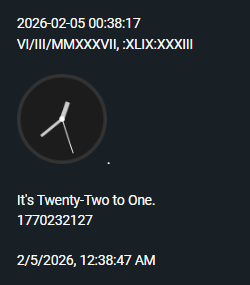

# Timestamp Plugin for Amplenote

A versatile timestamp generator for Amplenote, supporting Digital, Analog, Roman Numeral, and Natural Text formats.

## Installation

1. **Create a Plugin Note**: Create a new note in Amplenote (e.g., named "Timestamp Plugin").
2. **Setup Metadata Table**: At the very top of the note, create a table with the following structure:

| Field | Value |
| :--- | :--- |
| name | Timestamp |
| description | Different types of Timestamps. Every possibility that you can think of. You can modify them based on your needs using the info given in the below details using the different details in the below (View note Link). |
| icon | update |
| settings | timestamp for digital - structure |
| settings | timestamp analog - theme - dark / light / neon |
| settings | timestamp analog - post script |
| settings | timestamp text - pre script |
| settings | timestamp text - post script |

3. **Insert Code Block**: Below the table, create a single Javascript code block.
4. **Paste Compiled Code**: Copy the content from `build/timestamp.compiled.js` and paste it inside the code block.
5. **Activate**: Go to **Account Settings** -> **Plugins**, and select the note you just created.

## Settings Explained

| Setting Name | Default | Description |
| :--- | :--- | :--- |
| `timestamp for digital - structure` | `Y-m-d H:n:s` | Format string for Digital timestamps. Keys: Y (Year), m (Month), d (Day), H (Hour), n (Min), s (Sec), A (AM/PM). |
| `timestamp analog - theme` | `dark` | Visual theme for the Analog clock (`dark`, `light`, or `neon`). |
| `timestamp analog - post script` | *(empty)* | Text to append after the Analog clock image. |
| `timestamp text - pre/post script` | *(empty)* | Text to wrap around the natural text timestamp. |

## Usage

### Insert Text Commands
- **Digital**: Inserts a formatted date string (e.g., `2026-02-05 01:30:00`).
- **Roman**: Inserts the date/time using Roman numerals (e.g., `V/II/MMXXVI`).
- **Analog**: Inserts a live-generated SVG analog clock image.
- **Text**: Inserts a verbose "human" time (e.g., "It's half past One").
- **Unix**: Inserts the current Unix timestamp.

### Replace Text Commands
- **UnixToDateTime**: Select a Unix timestamp and run this to convert it to a readable local date string.

## Technical Details

This plugin follows a modular structure:
- `lib/formatters/`: Contains logic for generating different timestamp formats.
- `lib/replacers/`: Contains logic for text replacement actions.

The project uses `esbuild` to bundle these modules into a single artifact compatible with Amplenote's environment.
