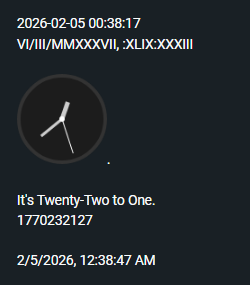

# Timestamp Plugin for Amplenote

A versatile Amplenote plugin that allows you to easily insert timestamps in multiple formats, including Digital, Roman Numerals, Analog (SVG clock), verbose text, and Unix time. It also features a utility to replace Unix timestamps with local date times.



## Installation

1. **Create a Plugin Note**: Create a new note in Amplenote (e.g., named "Timestamp Plugin").
2. **Setup Metadata Table**: At the very top of the note, create a table with the following rows:

| Field | Value |
| :--- | :--- |
| name | Timestamp |
| description | Different types of Timestamps. Every possibility that you can think of. You can modify them based on your needs using the info given in the below details using the different details in the below (View note Link). |
| icon | update |
| settings | timestamp for digital - structure |
| settings | timestamp digital - timezone |
| settings | timestamp analog - theme - dark / light / neon |
| settings | timestamp analog - post script |
| settings | timestamp text - pre script |
| settings | timestamp text - post script |

3. **Insert Code Block**: Below the table, create a single Javascript code block (type ` ```javascript `).
4. **Paste Compiled Code**: Copy the content from `build/timestamp.compiled.js` and paste it inside that code block.
5. **Activate**: Go to **Account Settings** -> **Plugins**, and select the note you just created.

## Usage

Once installed, the plugin adds the following commands to your note:

### Insert Text Commands

Trigger these by typing `/` in a note and selecting the command.

- **`{ Digital }`**: Inserts a standard digital timestamp according to your configured `timestamp for digital - structure` setting. Supports Moment.js/Day.js style tokens and a special "ISO" keyword.
- **`{ Roman }`**: Inserts the current date and time formatted entirely in Roman numerals.
- **`{ Analog }`**: Inserts a visually appealing Analog clock as an image (SVG converted to PNG). The appearance can be customized via the theme and size settings.
- **`{ Text }`**: Inserts a verbose text representation of the current time (e.g., "It's half past Twelve").
- **`{ Unix }`**: Inserts the current Unix timestamp (seconds since epoch).

### Replace Text Commands

These commands act on selected text in your note.

- **`UnixToDateTime`**: Select a Unix timestamp in your note, run this command, and it will be replaced by your local date and time string.

## Settings Configuration

You can customize the plugin by modifying the values in your metadata table:

- **`timestamp for digital - structure`**: (Default: `YYYY-MM-DD HH:mm:ss`) The format string for the digital clock. Supports standard day.js formatting tokens or `ISO` for ISO-8601 formatting.
- **`timestamp digital - timezone`**: (Default: `local`) Allows you to force the digital formatter to use UTC by setting this to `UTC`.
- **`timestamp analog - theme - dark / light / neon`**: (Default: `dark`) The theme for the analog clock face. Valid values are `dark`, `light`, or `neon`.
- **`timestamp analog - size`**: (Default: `100`) The width and height (in pixels) of the inserted analog clock image.
- **`timestamp analog - post script`**: Additional text or markdown to append after the analog clock image.
- **`timestamp text - pre script`**: Text to prefix before the verbose text timestamp.
- **`timestamp text - post script`**: Text to append after the verbose text timestamp.

## Technical Details

This plugin is designed using a modular architecture to maintain readability and easy testing. 
- The `lib/formatters/` directory contains individual modules for each timestamp format type (`digital.js`, `analog.js`, `roman.js`, `text.js`, `unix.js`).
- The `lib/replacers/` directory contains logic for text transformation (`unix_to_datetime.js`).
- The main entry file `timestamp.js` imports these modules and exposes them to the Amplenote Plugin API structure.
- The project is bundled into a single file (`build/timestamp.compiled.js`) using `esbuild` to ensure compatibility with Amplenote's environment, wrapped in an IIFE.
